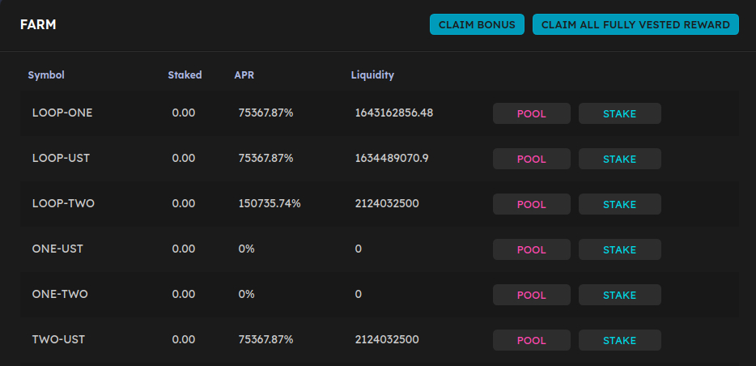

# Farming

Farming is a great way to earn LOOP rewards on LOOPMarket.

## Getting prepared 

Farming takes a little work to get set up.

You’re going to need some "LP Tokens" to enter into a Farm with. Farms can only accept their own exact LP Token. for example, the LOOP-UST Farm will only accept LOOP-UST LP Tokens.

To get the exact LP Token, you'll need to provide liquidity for that trading pair. So to get LOOP-UST LP Tokens, you'll first have to provide liquidity for the LOOP-UST pair.

It may sound intimidating, but it's not too complicated. Let's go through step by step.

### Finding your Farm 

Before you proceed, you'll want to choose a Farm that's right for you. [Visit the Farms page](https://tequila-graph.loop.markets/farm#stake) and you’ll see a list of available Farms.

When you find a Farm that you'd like to use, note down the trading pair, e.g. LOOP-UST in case you need it later.

### Providing liquidity to get LP Tokens 

Now that you've found a Farm to stake in, you will need to add liquidity to get your LP Tokens.

1. Click on [POOL](https://tequila-graph.loop.markets/pool#provide) on the left Menu list to swap the Token Pair to get **LP** tokens. 

   2.

## Putting your LP Tokens into a farm 

Now that you have your LP Tokens, you’re ready to start staking them in a Farm and earning rewards!

### Putting your LP Tokens into the Farm 

1. Go back to the [Farms page](https://tequila-graph.loop.markets/farm#stake) and locate your Farm. Click on the \(**+\)** showing your pair. It will expand to show more details.
2. Click on \(**+ Stake LP**\) and a new window will appear.

                                            **Image Here**

Type the amount of LP Tokens you would like to farm with into the field, or just click **Max** to use all of your LP Tokens.

1. When you have the amount entered, the **Confirm** button will light up. Click it. Your wallet will ask you to confirm your action.

                                                **Image Here**

1. After a short wait, the window will close, and you will see your new staked LP Token balance in the details

## Adding or removing LP Tokens from a Farm 

You may decide you would like to add more LP Tokens to a Farm at a later date, or to take some out of a Farm. You can do this very easily whenever you'd like.

