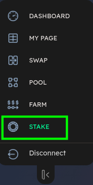
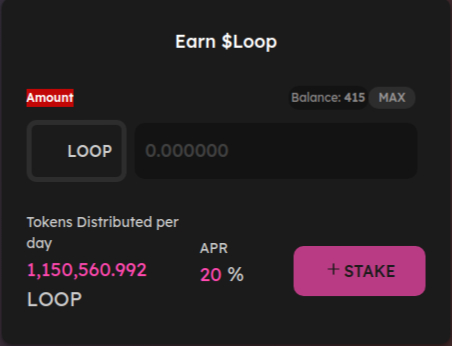

# Stake

## Putting your LP Tokens into a farm 

So, you have **LOOP** Tokens, you can start staking them directly and earn **LOOP** Tokens in rewards.

1. Click on the [Stake](https://tequila-graph.loop.markets/loop-stake#stake) on the left menu list

On the right side you will find a section with heading Earn $LOOP

